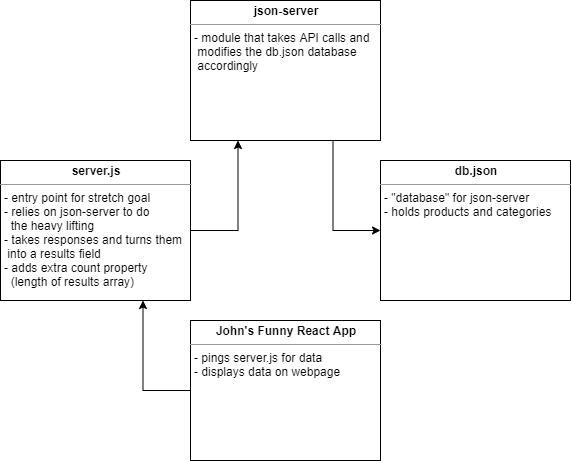

# LAB: HTTP and REST (06)

## Simple API

### Author: Earl Jay Caoile

### Links and Resources

- [submission PR](https://github.com/earljay-caoile-401-advanced-javascript/simple-api/pull/1)
- [GitHub Actions](https://github.com/earljay-caoile-401-advanced-javascript/simple-api/actions)

#### Documentation

- [JSON-Server Docs (GitHub)](https://github.com/typicode/json-server)

### Setup

#### Starting up the app

##### Original Lab

Type the following into the Terminal or Git Bash: `json-server --watch ./data/db.json`

Routes work off the following URL: `http://localhost:3000`

- i.e.: get route for categories is `http://localhost:3000/categories`
- get route for individual category is the whole get route plus category ID: i.e. `http://localhost:3000/categories/1`

##### Stretch Goal

Type the following into the Terminal or Git Bash: `node server.js`

Routes work off the following URL: `http://localhost:3000/api/v1`

- i.e.: get route for categories is `http://localhost:3000/api/v1/categories`
- get route for individual category is the whole get route plus category ID: i.e. `http://localhost:3000/categories/api/v1/1`

### Endpoints (both original and stretch goal)

**/categories** GET, POST

**/categories/:id/** PUT, DELETE

**/products** GET, POST

**/products/:id/** PUT, DELETE

### Data models

Category:

```
{
  "name": "mythical_weapons",
  "display_name": "Mythical Weapons",
  "description": "I shall smite thee!",
  "id": 1
},
```

Product:

```
{
  "category": "mythical_weapons",
  "name": "mjolnir",
  "display_name": "Mjolnir",
  "description": "Thor's hammer. It can only be wielded by those who are worthy!",
  "id": 1
},
```

### Verifying API

Check that the server is working properly by verifying with this [React application](https://w638oyk7o8.csb.app/)

- In the form at the top of the page, enter the URL to your API Server
- This server is configured to use the routes noted in the first lab requirement
- If your server is working, this app will show your API Data!

**Note**: the `category` property in a product must exactly match the name (not `display_name`) property for the React app to properly make the association between a `product` and its appropriate `category`

### UML


